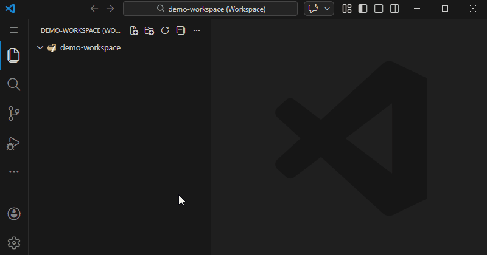

# Auto Path Header

Auto Path Header is a Visual Studio Code extension that automatically inserts the relative file path as a comment on the first line.



## Features

- Automatic insertion of the file path on open (only for files with a single empty line - files with content will not be automatically modified); for files with content, you can manually insert the comment via Command Palette
- Support for many file extensions
- Duplicate comment prevention
- RU/EN localization support
- Configurable settings
- Error handling with localized messages
- Automatic path update on rename/move
- Manual comment insertion via Command Palette

## Supported file extensions

### Single-line comments (`//`)
- .js, .ts, .jsx, .tsx, .java, .c, .cpp, .h, .hpp, .cs, .go, .rs, .swift, .kt, .kts, .php

### Hash comments (`#`)
- .py, .sh, .bash, .zsh, .rb, .pl, .pm, .env, .txt, .yml, .yaml

### Block comments (`/* */`)
- .css, .scss, .sass, .less, .json

### SQL comments (`--`)
- .sql, .lua, .hs

### HTML comments (`<!-- -->`)
- .html, .htm, .xml, .md, .markdown, .svg

### Other comment styles
- .ini (semicolon comments `; `)
- .bat, .cmd (REM comments `@REM `)

## Installation

1. Download the `.vsix` package from releases
2. In VS Code: `Ctrl+Shift+P` → "Extensions: Install from VSIX..."
3. Pick the downloaded file
4. (Optional) Once published, you can install it directly from the VS Code Marketplace by searching for "Auto Path Header".

## Activation

The extension activates immediately after installation to handle files with any extension. It monitors file opening events and automatically inserts path comments based on the file extension according to your configuration.

## Settings

- `autoPathHeader.enabled` — enable/disable automatic insertion
- `autoPathHeader.language` — message language (auto/en/ru)
- `autoPathHeader.updateOnRename` — automatically update comment on rename/move
- `autoPathHeader.askBeforeUpdate` — ask before updating comment (works when updateOnRename = true)
- `autoPathHeader.formatTemplate` — customize the comment line. Supports `{comment}`, `{path}`, `{prefix}`, `{suffix}` placeholders.
- `autoPathHeader.allowedOnlyDirectories` — array of directory names, relative paths or **glob patterns** (relative to the workspace root). Patterns follow [minimatch](https://www.npmjs.com/package/minimatch) syntax, so you can use `*`, `**`, `?`, character classes, etc. When non‑empty, files will only be processed if their path matches one of the entries. The default value is `['src', 'app']`; setting this configuration replaces the default list completely (it does **not** append). Examples:
  - `['main', 'css']` restricts insertion to those folders
  - `['.']` allows every path (root and subdirectories)
  - `['src/**']` allows files under any subfolder of `src`
  - `['**/utils']` allows files inside any `utils` directory

- `autoPathHeader.ignoredDirectories` — array of directory names, relative paths or **glob patterns** (minimatch). Files located inside any matching directory will be ignored for automatic insertion and updates. **Setting this value replaces the default list completely; it does not append.** If you only need to block a few paths, consider using the opposite whitelist setting `autoPathHeader.allowedOnlyDirectories` instead. The default ignored list is `['node_modules', 'vendor', 'vendors', 'dist', 'build', '.git', '.svn', '.hg', 'target', 'out', 'bin']`. Examples:
  - `['**/node_modules', '**/dist']` to ignore those folders anywhere
  - `['temp/*']` to ignore immediate children of `temp`

  _Example: replace all defaults with a custom ignore list (plain names or glob patterns)_
  ```jsonc
  {
    "autoPathHeader.ignoredDirectories": [
      "temp",              // simple directory
      "**/node_modules",   // glob: anywhere in workspace
      "dist/*"             // glob: immediate children of dist
    ]
  }
  ```
  _Example using whitelist to allow only specific folders (supports globs)_
  ```jsonc
  {
    "autoPathHeader.allowedOnlyDirectories": [
      "src",              // only src folder
      "**/utils",         // any utils directory at any depth
      "src/**/*.ts"       // all TypeScript files under src
    ]
  }
  ```

  **Note:** the ignored-directory check runs _before_ the allowed-only check. If the same path (e.g. "temp") appears in both lists, the file will be treated as ignored and no comment will be inserted, regardless of the whitelist entry.
- `autoPathHeader.disabledExtensions` — array of file extensions where auto insertion/updates are disabled (e.g. ['.log', '.tmp']).
- `autoPathHeader.customTemplatesByExtension` — custom templates by file extension. Supports `{path}`, `{filename}`, `{dirname}` placeholders. Priority: customTemplatesByExtension[extension] → formatTemplate → default language comment format. The extension is determined by path.extname(filePath) (including dot), case-insensitive. This supports compound extensions like `.env.local` as well as specific file names like `Dockerfile.dev`.

### Comment template configuration

`formatTemplate` allows you to change how the first line looks. The extension substitutes placeholders with actual values:

| Placeholder | Description                          | Example value            |
|-------------|--------------------------------------|--------------------------|
| `{comment}` | Full comment with prefix & suffix    | `// src/utils/file.ts`   |
| `{path}`    | Relative path only                   | `src/utils/file.ts`      |
| `{prefix}`  | Language-specific opening token      | `// `, `/* `, `<!-- `    |
| `{suffix}`  | Closing token (if the language has it)| ` */`, ` -->`            |

Examples:

```jsonc
{
  "autoPathHeader.formatTemplate": "{prefix}[{path}]{suffix}"
}
```

```jsonc
{
  "autoPathHeader.formatTemplate": "// File: {path}"
}
```

### Disabling by file extension

If you need to disable automatic comments for specific file extensions (for example, log files or temporary files), add their extensions to `disabledExtensions`:

```jsonc
{
  "autoPathHeader.disabledExtensions": [
    ".log",
    ".tmp",
    ".temp",
    ".cache"
  ]
}
```

The manual command will respect this list and show a message instead of inserting a comment.

### Custom templates by file extension

You can define custom templates for ANY file extension. This allows different formatting for different file types. The extension determines the file extension including the dot, and is case-insensitive. This supports compound extensions like `.env.local` as well as specific file names like `Dockerfile.dev`.

Priority order for template selection:
1. `customTemplatesByExtension[specific file name]` (e.g., "Dockerfile.dev")
2. `customTemplatesByExtension[compound extension]` (e.g., ".env.local")
3. `customTemplatesByExtension[regular extension]` (e.g., ".ts")
4. `formatTemplate` (if set)
5. Default language comment format

```jsonc
{
  "autoPathHeader.customTemplatesByExtension": {
    ".env.local": "# LOCAL OVERRIDE — {path}",
    ".test.ts": "// 🧪 TEST: {path}",
    "Dockerfile.dev": "# DEV BUILD: {path}",
    ".txt": "# TEXT FILE: {path}",
    ".log": "// LOG FILE: {path}"
  }
}
```

Supported placeholders for custom templates include `{path}`, `{filename}`, and `{dirname}` which will be replaced with the actual values when inserting the comment.

This configuration allows you to define templates for ANY file extension. Simply add an entry with the desired file extension (starting with a dot) as the key and your custom template as the value. The extension will automatically apply the appropriate template based on the file extension when inserting path comments.

Additionally, you can define a default template for ALL file extensions using the special `*` key:

```jsonc
{
  "autoPathHeader.customTemplatesByExtension": {
    "*": "// FILE: {path}",  // This applies to ALL files by default
    ".env.local": "# LOCAL OVERRIDE — {path}",  // Specific overrides still work
    ".test.ts": "// 🧪 TEST: {path}"
  }
}
```

Note that specific file names and extensions will take precedence over the wildcard template.

## Usage

- Works automatically on file open (for supported file extensions) - but only for files that initially have a single empty line (files with existing content will not be automatically modified)
- Manual insertion:
  1. `Ctrl+Shift+P` → "Auto Path Header: Insert Path Comment"

## Development

### Requirements
- Node.js
- VS Code Extension Development Host

### Install deps
```bash
npm install
```

### Compile
```bash
npm run compile
```

### Package
```bash
npm run package
```

## Tests

- Unit tests (Mocha):
```bash
npm test
```

- VS Code integration tests:
```bash
npm run test:it
```

## Contributing

1. Fork this repository
2. Create a feature branch
3. Implement changes
4. Add/adjust tests
5. Open a Pull Request

## License

MIT License

## Release notes

## Support

If you have questions or suggestions, please open an Issue.
